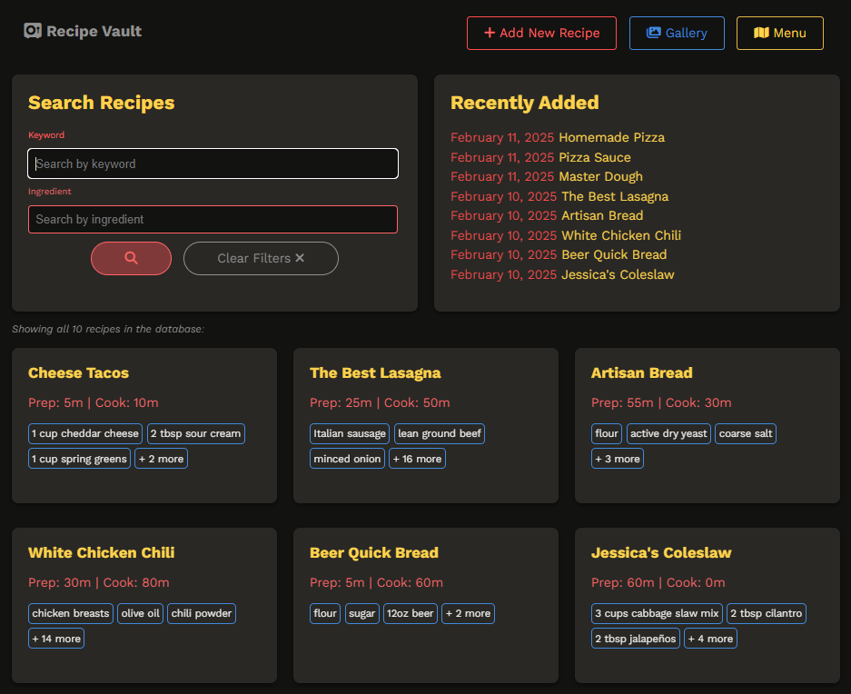
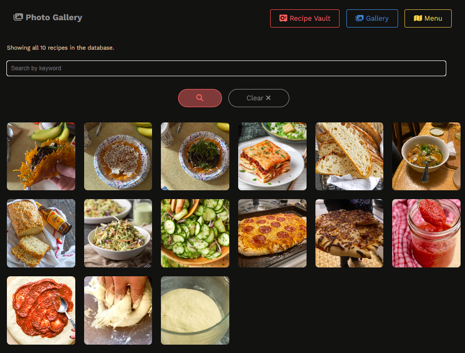
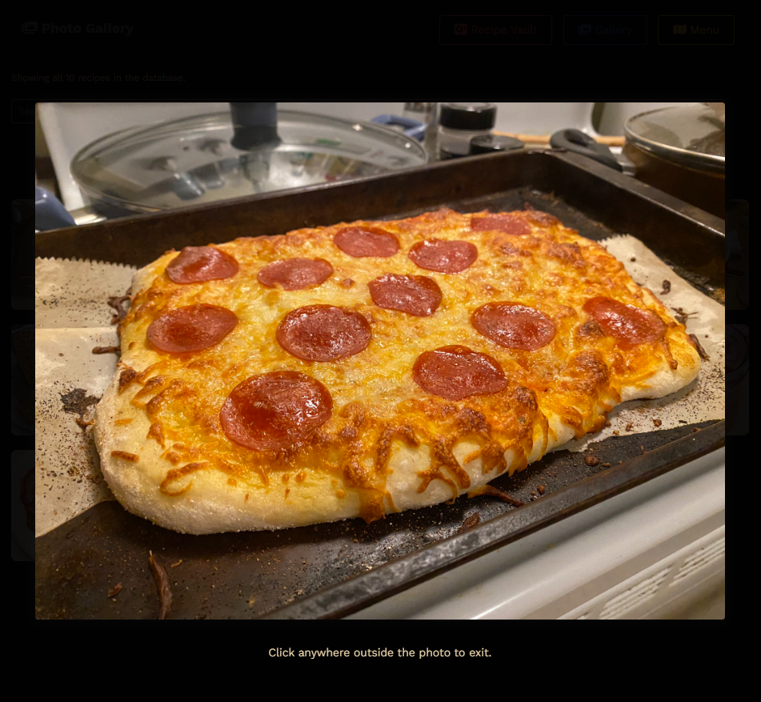

# Chef's Reference Tool (Recipe Index)
This app for the web browser allows kitchen workers a quick and easy reference tool for finding, creating, and revising recipes.
"I finally get to save all those treasured, greasy stacks of hand-scribbled recipes from their poor, crumpled state!" - Real Testimonial

## UI Preview 

## Features
- [x] Quick reference dashboard
- [x] Add, update and delete recipes, details, and images
- [x] Recently added recipes feed
- [x] Recipe search by keyword and/or ingredient tool
- [x] Responsive recipe cards and layouts

## Working On
- [X] Page layouts
- [X] Improve the `+ Add Recipe` CTA in the header section
- [X] Display search result filters and count for searches
- [ ] Implement `categories` column into `recipes` table
- [ ] Implement categorical search filter, top categories section in dashboard
- [x] Ingredient measurements

## Data
- [x] Recipes and image paths stored in sqlite database
- [x] Uploaded images are renamed with a unique hash
- [x] Images are saved and managed inside `static/uploads` 
- [x] Database is optimized regularly for performance

## Ingredient Measurements
- [ ] Update the database to record measurements for ingredients
- [ ] Update `app.py` to handle the new schema
- [ ] Update templates to show measurements where appropriate